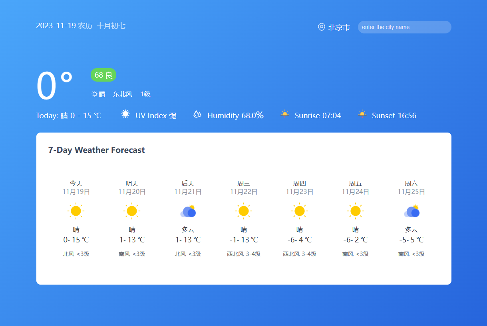

# Weather_forecasts
A weather forecasts web page using `HTML+CSS+JS+AXIOS`(simple Encapsulated with XMLHttpRequest+Promise).

You can switch the weather forecast by searching and selecting the corresponding city in the search bar in the upper right corner (currently only supports cities in China).  

## Supporting functions:  

**1. current date**
- date
- lunar calendar of the current date

**2. search city**
- city name
- city code
- link with keyword

**3. today’s weather (of the selected city)**
- temperature
- wind direction and level
- air quality (AQI - Air Quality Index)
- ultraviolet intensity
- humidity
- sunrise and sunset time

**4. seven-day weather forecast display (of the selected city)**
- weather
- temperature
- date
- wind direction and level
